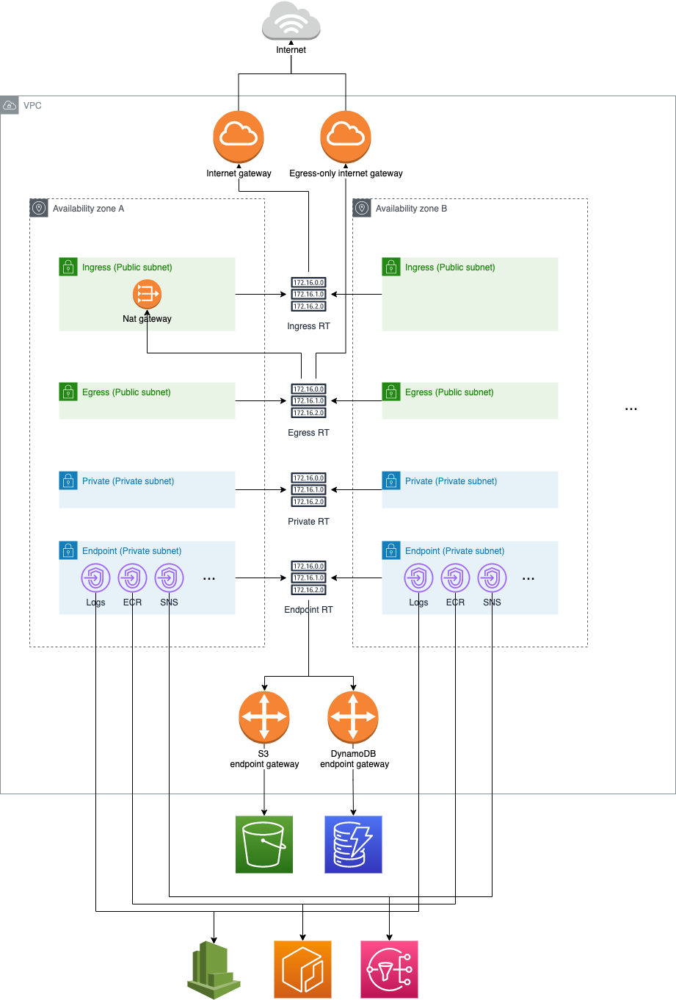
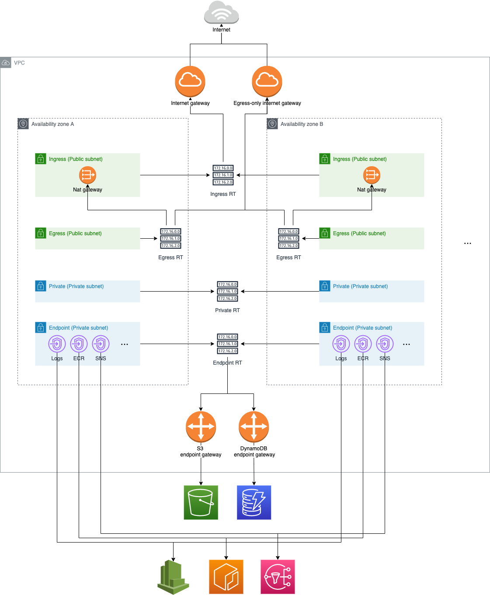

# terraform-aws-networks

## Terraform versions
* Terraform \>= 1.0.0
* AWS provider \>= 3.50

## Overview
* Architecture diagram (Default, without HA for NAT gateway. `enable_multiple_nat_gateways`=false)


* Architecture diagram (Production mode, with HA for NAT gateway. `enable_multiple_nat_gateways`=true)



## Usage example: 
```hcl
module "network" {
  source         = "tf.kk.stream/KKS/aws-networks/kks"
  version        = "0.3.1"
  source         = "../terraform-aws-networks"
  project        = "network"
  vpc_cidr       = "55.1.0.0/16"
  subnet_indexes = {
    ingress  = [0, 1]
    egress = [2, 3]
    private  = [4]
  }
}
```

## Inputs
| Name | Description | Type | Default | Required |
|------|-------------|------|---------|:--------:|
| project | project for current app | `string` | no | yes |
| environment | Development environment, default use terraform.workspace | `string` | `""` | no |
| region | The region for VPC, default use provider region | `string` | `""` | no |
| az | Availability zones in the region, default use the first three availability zones in the region | `list(string)` | `[]` | no |
| vpc_cidr | IPv4 CIDR. Suggest /16 as the primary solution to initiate a new VPC. Use lower CIDR if you wants more IP in individual subnets. (/16, Will give 256 address for every subnet.) | `string` | no | yes |
| subnet_indexes | Network indexes, If you want a egress, it must has one ingress for Nat-gateway. | `object({ingress=list(number), egress=list(number), private=list(number)})` | `{ingress=[1, 2, 3], egress=[4, 5, 6], private=[7, 8, 9]}` | no |
| subnet_newbits | Subnet new bits. Ex: 10.1.0.0/16 (VPC) with 8 for newbits, every subnet will be given `/24`. | `number` | `8` | no |
| enable_multiple_nat_gateways | Enable multiple NAT gateway for HA. It will create the number as same as availability zones. Ex: 3 AZ, if the config enable, 3 NAT gateway will be created.  | `bool` | `false` | no |
| ingress_subnet_rt_vpc_peering | Deprecated, Ingress route table for vpc peering | `list(object(connection_id=string, cidr=string))` | `[]` | no |
| egress_subnet_rt_vpc_peering | Deprecated, Egress route table for vpc peering | `list(object(connection_id=string, cidr=string))` | `[]` | no |
| private_subnet_rt_vpc_peering | Deprecated, Private route table for vpc peering | `list(object(connection_id=string, cidr=string))` | `[]` | no |
| endpoint_subnet_rt_vpc_peering | Deprecated, Endpoint route table for vpc peering | `list(object(connection_id=string, cidr=string))` | `[]` | no |
| gateway_endpoint_services | Services of VPC gateway endpoints | `list(string)` | `["s3", "dynamodb"]` | no |
| interface_endpoint_services | Services of VPC interface endpoints | `list(string)` | `["logs", "ecr.dkr", "ecr.api", "secretsmanager", "sqs", "sns", "ssm"]` | no |
| gateway_endpoint_service_names | Service names of VPC gateway endpoints, if not empty, will use the service names instead of services. | `list(string)` | `[]` | no |
| interface_endpoint_service_names | Service names of VPC interface endpoints, if not empty, will use the service names instead of services. | `list(string)` | `[]` | no |
| tags | Tags for resources | `map(string)` | `{}` | no |


## Outputs
| Name | Description |
|------|-------------|
| vpc_id | VPC ID |
| region | The region for VPC |
| az | Availability zones in the region |
| egress_subnet_ids | Egress subnet IDs |
| egress_rt_id | Egress route table ID. In `enable_multiple_nat_gateways` mode, return the first. |
| egress_rt_ids | Egress route table IDs. |
| ingress_subnet_ids | Ingress subnet IDs |
| ingress_rt_id | Ingress route table ID |
| private_subnet_ids | Private subnet IDs |
| private_rt_id | Private route table ID |
| endpoint_subnet_ids | Endpoint subnet IDs |

